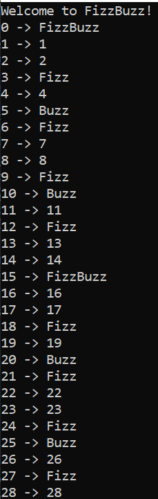

# FizzBuzz

In this small exercize, I try to implement the TDD method. I first write a test that goes red, then I modify the code in order to pass the test, then I refactor if necessary. You will find all the steps of the progression in the commits.

Here are the rules for FizzBuzz :

1. If the integer is a multiple of 3, return **Fizz**.
2. If the integer is a multiple of 5, return **Buzz**.
3. If the integer is a multiple of both 3 and 5, return **FizzBuzz**.  
4. In any other case, simply return the integer as-is.

Here is the output that you will find :

